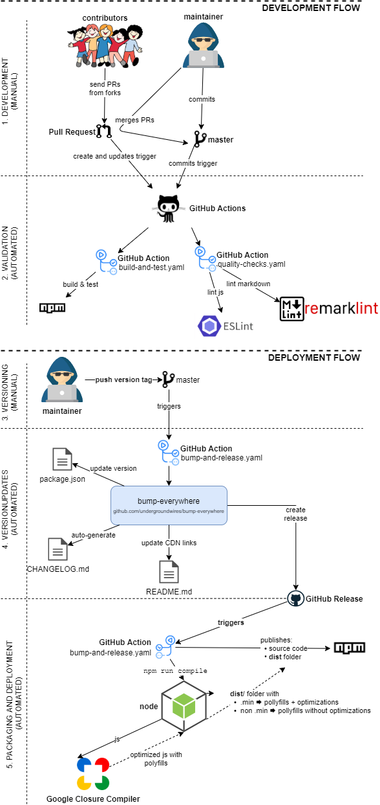

# safe-email

> 🛡️📧 Protect e-mails against spam and scraping bots

[](https://github.com/undergroundwires/safe-email/issues)
[](./.github/workflows/publish.yaml)
[](./.github/workflows/build-and-test.yaml)
[](./.github/workflows/bump-and-release.yaml)
[](./.github/workflows/quality-checks.yaml)
[](https://www.npmjs.com/package/safe-email)
[](https://github.com/undergroundwires/bump-everywhere)
<!-- [](https://www.npmjs.com/package/safe-email)
[](https://www.jsdelivr.com/package/npm/safe-email) -->

Easy way to obfuscate e-mails to have spam protection against scraping bots.

- Vanilla JavaScript only ✔️
- Very lightweight with no dependencies ✔️
- Easy to configure by using HTML attributes ✔️

## How it works 🛡️

- Base64 encoding of e-mail
- CSS tricks to show the right text only to humans
- Obfuscating HTML text of the e-mail

## Import

### Option A: Use CDN

It's the simplest way. Just add it to your page:

```html
<script type="text/javascript" src="https://cdn.jsdelivr.net/npm/safe-email@1.1.0/dist/safe-email.min.js"></script>
```

### Option B: Install

- Using NPM (recommended): `npm install safe-email --save`
- Using bower: `bower install undergroundwires/safe-email`
- As a git submodule:
  - Go to the folder you wish to have the repository
  - Run `git submodule add https://github.com/undergroundwires/safe-email`
- ❗ Only CDN and NPM solutions will have minified files with polyfills (`dist/` folder)

```html
<script type="text/javascript" src="/node_modules/safe-email/dist/safe-email.min.js"></script>
```

*[top↑](#safe-email)*

## Usage

### Examples

#### Simplest

```html
  <a title="Email" href="#" data-email_b64="dW5kZXJncm91bmR3aXJlc0BnaXRodWIuY29t"></a>
```

[See it live on CodePen](https://codepen.io/undergroundwires/pen/XWbLMOL)

#### With all properties

```html
  <a title="Email" href="#" data-email_b64="dW5kZXJncm91bmR3aXJlc0BnaXRodWIuY29t"
    data-body="Hello!" data-subject="About website"></a>
```

[See it live on CodePen](https://codepen.io/undergroundwires/pen/MWwMpRL)

#### With icon

```html
<a title="Email" href="#" data-email_b64="dW5kZXJncm91bmR3aXJlc0BnaXRodWIuY29t">
    <svg xmlns="http://www.w3.org/2000/svg" width="24" height="24" viewBox="0 0 24 24" fill="none" stroke="currentColor" stroke-width="2" stroke-linecap="round" stroke-linejoin="round"><path d="M4 4h16c1.1 0 2 .9 2 2v12c0 1.1-.9 2-2 2H4c-1.1 0-2-.9-2-2V6c0-1.1.9-2 2-2z"></path><polyline points="22,6 12,13 2,6"></polyline></svg>
</a>
```

[See it live on CodePen](https://codepen.io/undergroundwires/pen/GRJbWaE)

As icon is an inner HTML of the parent `<a>` your e-mail will not be rendered.

### Properties

| Property | Explanation | Required / Default |
| -------- | ----------- | -------- |
| **`data-email_b64`** | Base64 encoded text of your e-mail. You can encode your e-mail [here](https://www.base64encode.org/). | Required |
|  **`data-body`** | Body of the e-mail | Optional, Defaults to `Hi!` |
|  **`data-subject`** | Subject of the e-mail | Optional,  Defaults to root domain name + path, e.g. `abc.com/path` |

Any element that has **`data-email_b64`** property defined will have obfuscated `mailto:` pointing to the given e-mail address. If owner element of this property has no inner HTML, then the e-mail (in obfuscated form) will be rendered.

*[top↑](#safe-email)*

## Package contents

The deployed packages includes a `dist/` folder that adds polyfills to the files and distributes them as:

- minified (`.min.js`) files for production usage
- non-minified (`.js`) files for debugging

*[top↑](#safe-email)*

## GitOps

CI/CD is fully automated for this repo using different Git events & GitHub actions.



*[top↑](#safe-email)*
